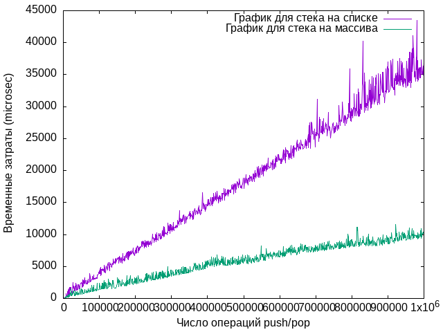

# FirstAlgoLaba
## Requirements
gcc

bash

gnuplot https://archlinux.org/packages/extra/x86_64/gnuplot/

## Running tests
TL;DR - запустить ./main.sh, тесты соберутся и запустятся автоматически, построится график outputs/graph.png

Склонировать репозиторий, запустить ./main.sh. main.sh автоматически собирает тесты с первого по четвёртый, запускает их, и сохраняет время работы в файлики в папку outputs, затем запускает скрипт plot.sh, который строит график по данным из outputs при помощи утилиты gnuplot и сохраняет его в outputs. Суммарное время сборки и работы всех тестов около 38 секунд на моей системе.
## Выводы
Судя по графику и временным замерам по 1-3 тестам, стек на массиве работает быстрее

